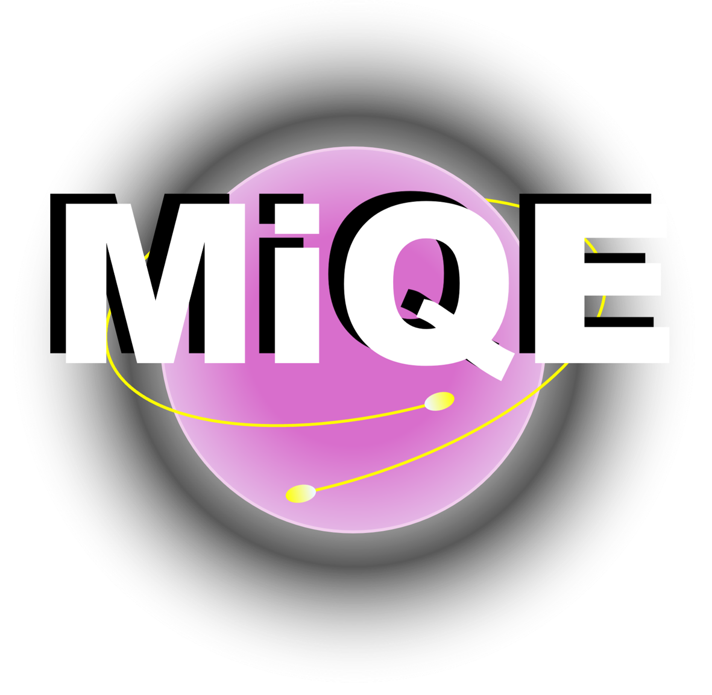

<p align="center">
  
</p>

# MiQE: Mini Quantum Emulator

**Single-file quantum computer emulator. Runs on Python.**  

Currently capable of simulating small-scale (below 10 qubits) quantum algorithms and circuits.

Uses big-endian convention for qubit ordering.

This easy-to-use program is intended for:
- Learners wanting to understand the logic behind quantum computation.
- Users who want to simulate their own simple quantum systems.
- Users who want to build their own quantum emulator from a simple initial foundation.

The compact and low-complexity design of **MiQE** makes it easy to modify the source code for a variety of uses and quantum computing investigations.

This project is inspired by Qiskit, and although not nearly as powerful, efficient, or useful as Qiskit, **MiQE** is still more than sufficient for basic tasks.

---

## Installation

To use, place [MiQE.py](MiQE.py) into the same directory as the Python code file you are importing to and, ensuring you have the required packages installed on your system, simply run:
```python
from MiQE import *
```
Alternatively, just copy the code into the same Python code file without importing.

---

## Current Features

- Initialisation and conversion between state vector and density matrix forms.
- Single-qubit Pauli error simulation and random error injection.
- Unary and multi-control qubit gate implementation, with a near-complete quantum gate library.
- Partial and full measurements.
- Simple dephasing and depolarising channels (exclusive to density matrices).
- LaTeX visualisation of state vectors (column form and Dirac notation) and density matrices.
- Probability amplitude plotting using Matplotlib.
- Circuit execution with basis state measurement plots.

---

## Future Plans

- More visualisation tools (circuit diagrams, Bloch spheres, graphs, etc.).
- Improve efficiency and performance.
- Expand algorithm support and extend functionality for more complex applications.
- Allow for controlled gates to act over multiple target qubits.

---

Logo designed and created by EWMC.
